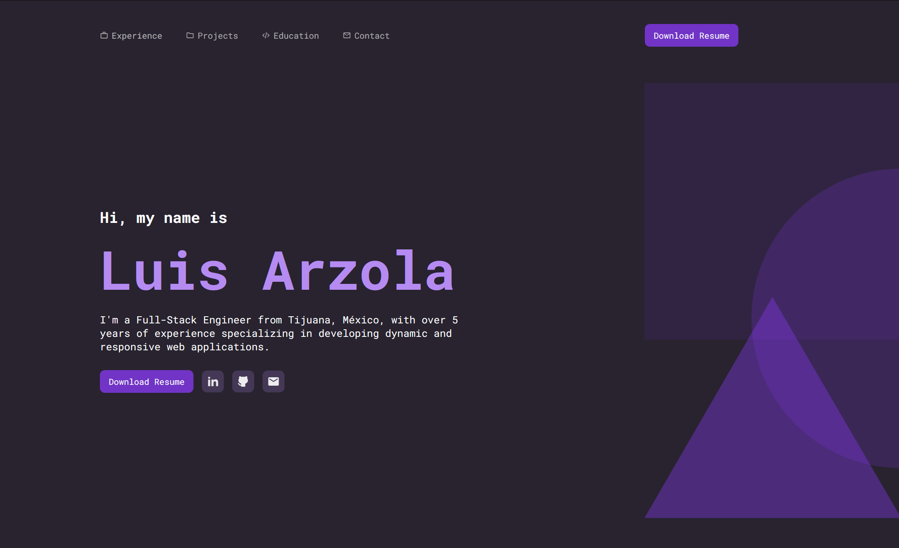

# Portfolio Website - [luisarzola.com](https://luisarzola.com)



This is my personal portfolio website built with **Astro**, **TypeScript**, and **Tailwind CSS**. The portfolio showcases my professional work experience, selected projects, and education. It serves as a platform to highlight my skills as a **Full-Stack Web Developer**, emphasizing **responsive design**, **clean code**, and **modern web technologies**.

## Features

-   **Professional Experience**: Display of work experience at companies like Plumber Marketing USA and Dude Agency, along with detailed information about freelance projects.
-   **Selected Projects**: Overview of notable projects, including:
    -   **Pokedex App**: Built with React and SCSS using PokeAPI.
    -   **Smite Game Landing Page**: Developed using Astro, TypeScript, and Tailwind.
    -   **World Cup 2022 Website**: Interactive stats and information built with React, HTML, CSS, and JavaScript.
    -   **E-Commerce Website for Cosmetology**: Built with PHP, MySQL, and JavaScript.
    -   \*\*And more.
-   **Education**: Highlight of educational background relevant to web development and programming.
-   **Responsive Design**: The website adapts to all device sizes for an optimal viewing experience.

## Tech Stack

-   **Astro**: A modern, fast framework for building static websites.
-   **TypeScript**: Static type-checking for scalable and maintainable code.
-   **Tailwind CSS**: Utility-first CSS framework for efficient styling.
-   **HTML5 & CSS3**: Used to structure and style the core content of the website.
-   **JavaScript/TypeScript**: Used to handle interactivity and functionality.

## Getting Started

### Prerequisites

Make sure you have the following installed on your machine:

-   Node.js (>= 14.x)
-   npm (>= 6.x) or yarn

### Installation

1. Clone the repository:

    ```bash
    git clone https://github.com/yourusername/your-portfolio.git
    ```

2. Navigate to the project directory:

    ```bash
    cd your-portfolio
    ```

3. Install dependencies:
    ```bash
    npm install
    ```

### Running the Project Locally

1. Run the development server:

    ```bash
    npm run dev
    ```

2. Open your browser and go to `http://localhost:4321`.

## Project Structure

```bash
├── .astro/
├── .vscode/
├── node_modules/
├── public/
│   ├── img/
│   ├── svg/
│   ├── resume.pdf
│   └── screenshot.png
├── src/
│   ├── components/
│   ├── data/
│   ├── layouts/
│   ├── pages/
│   ├── sections/
│   ├── types/
├── .gitignore
├── astro.config.mjs
├── env.d.ts
├── package.json
├── package-lock.json
├── README.md
├── tailwind.config.mjs
└── tsconfig.json
```

-   **.astro/**: Astro build cache.
-   **public/**: Static assets like images, PDFs, and other public resources.
    -   **img/**: Folder for image assets.
    -   **svg/**: Folder for SVG files.
    -   **resume.pdf**: Resume file.
    -   **screenshot.png**: Screenshot of the portfolio.
-   **src/components/**: Reusable components like project cards, buttons.
-   **src/layouts/**: Layout templates for pages.
-   **src/pages/**: Index page.
-   **src/sections/**: Larger sections like header, footer, and main content sections.
-   **src/types/**: TypeScript type definitions.
-   **astro.config.mjs**: Configuration file for the Astro project.
-   **tailwind.config.mjs**: Configuration file for Tailwind CSS.
-   **tsconfig.json**: TypeScript configuration.

## Contact

Feel free to reach out if you have any questions or would like to collaborate:

-   **Email**: arzoladeveloper@gmail.com
-   **LinkedIn**: [Your LinkedIn](https://www.linkedin.com/in/luis-arzola/)
-   **GitHub**: [Your GitHub](https://github.com/ArzolaG)
